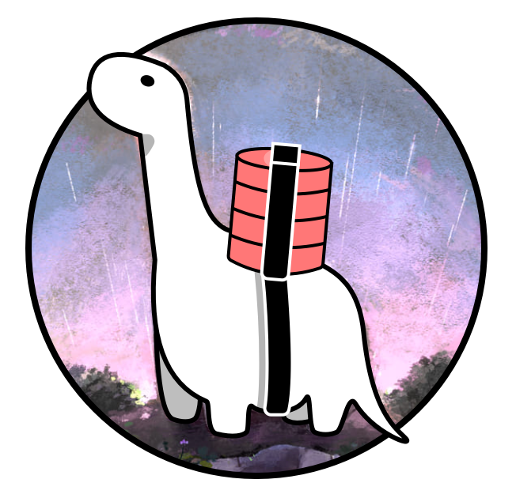

# dinoAPI-v2

Es un Ejemplo Basico de Construcion de REST API.

[](https://deno.land/)
[](https://deno.land/x/velociraptor/)
[](https://deno.land/x/denon/)
[](https://deno.land/x/trex/)
[](https://deno.land/x/servest/)
[](https://deno.land/x/denodb/)
[](https://www.postgresql.org/)


---
## Construido con 🛠️

* [deno](https://deno.land/) - Entorno de Ejecucion seguro para JavaScript y TypeScript.
* [velociraptor](https://deno.land/x/velociraptor/) - Velociraptor es un script runner.
* [denon](https://deno.land/x/denon/) - reemplazo para nodemon supervisará cualquier cambio en su fuente y reiniciará automáticamente.
* [trex](https://deno.land/x/trex/) - Manejador de dependencias.
* [serves](https://deno.land/x/servest/) - Un servidor http progresivo.
* [djwt](https://deno.land/x/djwt/) - JSON Web Tokens en deno. Basado en las especificaciones JWT y JWS.
* [Hash](https://deno.land/std/hash/mod.ts) - Cifado usando Hash peteneciente a la libreria estandar de Deno
* [denodb](https://deno.land/x/denodb/) - ORM para Deno.
* [postgres](https://www.postgresql.org/) - sistema de gestión de bases de datos relacional. 


## Comenzando 🚀

para probar clone el repositorio

```
git clone https://github.com/Juanhernandez1/dinoAPI-v2.git
```


### Pre-requisitos 📋

instalar todos los paquetes usados en la construcion

-- deno v 1.2.0
```
curl -fsSL https://deno.land/x/install/install.sh | sh -s v1.2.0
```
o ir a [link](https://github.com/denoland/deno_install#install-specific-version/)

-- velociraptor 
```
deno install -qA -n vr https://deno.land/x/velociraptor@v1.0.0-beta.13/cli.ts
```

-- denon 
```
deno install --allow-read --allow-run --allow-write --allow-net -f --unstable https://deno.land/x/denon@v2.2.1/denon.ts
```

-- trex 
```
deno install -A --unstable -n trex https://deno.land/x/trex/cli.ts
```
-- postgresSQL
puede probar WAPP un stack similar a XAMP con [link](https://bitnami.com/stack/wapp/installer/)

### Instalación 🔧

-- ingrese a la carpeta 

```
cd dinoAPI-v2
```

-- Cachear los paquetes con

```
trex install
```

-- tener conosimientos prebios de base de datos
 - crea la base de datos con el scritp sql en: 
 ```
 dinoAPI-v2/src/DataBase/database.sql
 ```
 - cambiar los datos de las variables de entorno en el archivo 
 ```
 dinoAPI-v2/denon.json
 ```    
 buscar y remplasar con sus respectivos datos
 ```
  "env": {
        "DB":"nombre base de datos",
        "PASS": "contraseña",
        "USER":"postgres",
        "HOST":"localhost",
        "PORTDB": "5432"
      }
 ```    


## Ejecutar

abir un terminal en el origen dinoAPI-v2 y escibir el siguiente comando
```
vr start
```

## Despliegue 📦
-- puede realizar pruevas de forma local con 
 - insomnia
 - postman

-- desde heroku

https://dinoapi-v2.herokuapp.com/login 

-- recuerde colocar basic auth en en todas las solicitudes  
 - insomnia
 - postman

 username : juan

 password: 1234

nota: 
el token mostrado en login sera tomado desde cookie o puede copiarlo y enviarlo en cabezar  

imágenes de pruebas en insomnia
https://github.com/Juanhernandez1/dinoAPI-v2/tree/master/assets/Uso%20en%20insomnia

auth_token : token

## Autor ✒️

* **Juan Hernandez** - *Trabajo Inicial* - 


---
⌨️ con ❤️ por [JuanHernandez](https://github.com/Juanhernandez1) 😊
